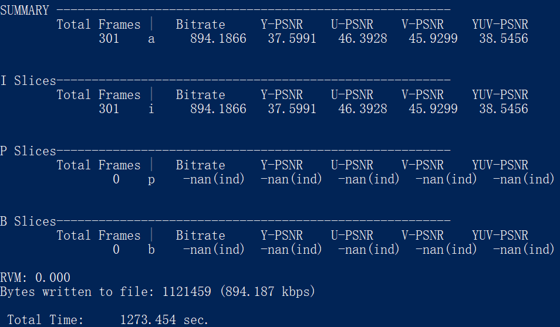

# Tools for calculating BDBR and BD-PSNR from HEVC outputs

When HEVC encoder finishes encoding a YUV sequence, it outputs some information on the command line, like this:



According to "Calculation of average PSNR differences between RD-Curves, VCEG-M33" and "Improvements of the BD-PSNR model, VCEG-AI11", Bjontegaard metric is often used to compare two methods. To be specific, **Bjøntegaard delta bit rate (BDBR)** and **Bjøntegaard delta peak signal-to-noise rate (BD-PSNR)**. We have the output of HEVC encoder, and here are some ready-to-use tools to calculate BDBR and BD-PSNR from the output (which gives us the bitrate and Y-PSNR).

**NOTE: These tools are all from the Internet.**

## Preparation
The data you need to prepare first before using any of the tools are at least four sets of data like this: (bitrate, Y-PSNR). You need four sets generated from original HEVC encoder and four sets generated from deep-learning-based encoder. Then, you can get the increase in BDBR and the degradation in BD-PSNR.

## Python3
Read the manual and get the python code in zip-file ```Bjontegaard-python3.zip```.

## C
> BD-PSNR/Rate computation tool for five data points, JCTVC-B055

Use the code in zip-file ```JCTVC-B055.zip```.

## Matlab

Code available at [GitHub-bjontegaard2](https://github.com/serge-m/bjontegaard2)

## Excel

|                             Tool name                              |                                                                                            Link                                                                                            |
| ------------------------------------------------------------------ | ------------------------------------------------------------------------------------------------------------------------------------------------------------------------------------------ |
| Common test conditions and software reference configurations       | ```JCTVC-L1100-v1.zip```                                                                                                                                                                   |
| An excel add-in for computing Bjontegaard metric and its evolution | ```VCEG-AE07.zip```                                                                                                                                                                        |
| Tools for proposal evaluations                                     | [JCTVC-A031](https://phenix.int-evry.fr/jct/doc_end_user/current_document.php?id=5117). [Downloadable link](https://www.itu.int/wftp3/av-arch/jctvc-site/2010_04_A_Dresden/JCTVC-A031.zip) |
| ETRO's Bjontegaard Metric implementation for Excel                 | [GitHub](https://github.com/tbr/bjontegaard_etro)                                                                                                                                          |